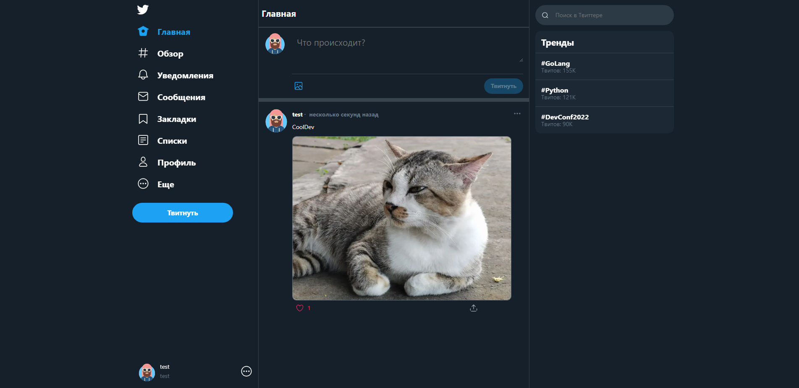

# MicroBlog

Корпоративный сервис микроблогов для общения между сотрудниками.


### Технологии

- [FastApi](https://fastapi.tiangolo.com/). Для реализации backend-а сервиса;
- [SqlAlchemy](https://www.sqlalchemy.org/) ORM. Для реализации моделей для хранения данных сервиса;
- [PostgreSQL](https://www.postgresql.org/). База Данных сервиса;

### Запуск

1. Клонируйте репозиторий
   командой ```git clone https://github.com/Surzhikov161/MicroBlog.git```
2. Установите [Docker](https://docs.docker.com/engine/install/), если у вас его нет;
3. Настроить параметры окружения (DB_USER, DB_PASS, DB_DATABASE_NAME) в файле .env и DATABASE_URI в
   app/backend/Dockerfile;
4. Прописать в терминале команду docker compose up -d.

Если нужно запустить отдельно fastapi приложение:

1. Перейдите в папку приложение ```cd app```;
2. Запустите приложение командой ```uvicorn backend.src.main:app --host <url> --port <port>```.
